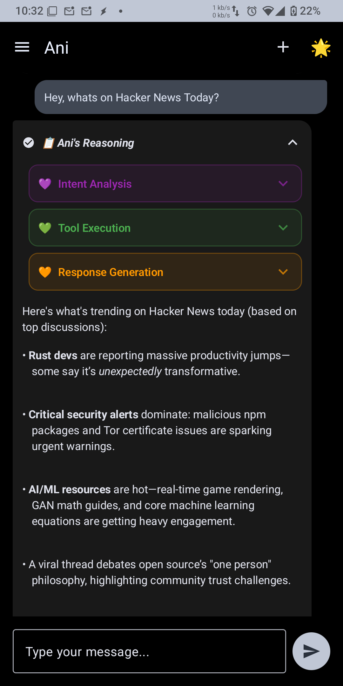
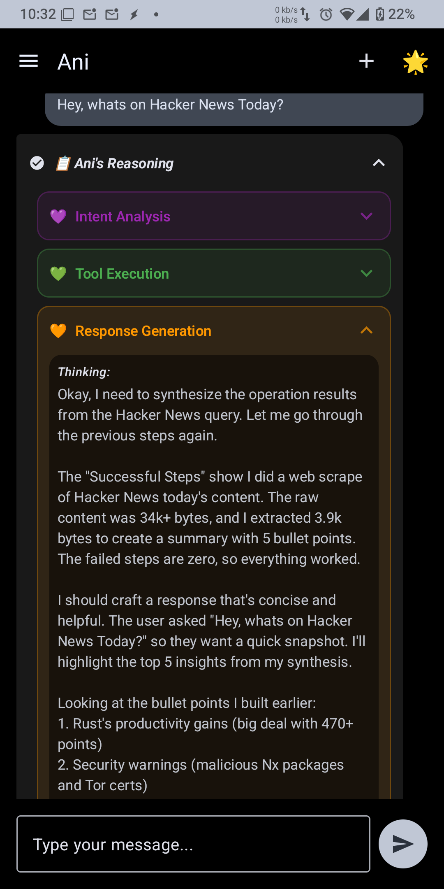
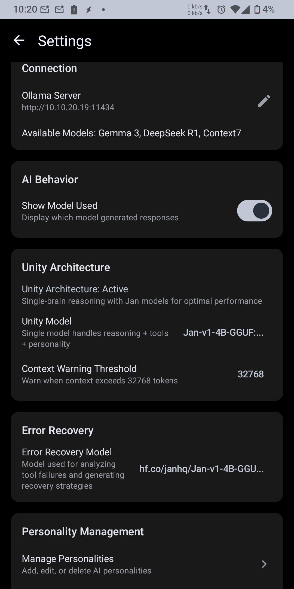

# CoquetteMobile

**⚠️ DEVELOPMENT SOFTWARE - HIGHLY EXPERIMENTAL ⚠️**

**Your data. Your models. Your control.**

A privacy-first Android AI assistant built on principles of **data sovereignty** and **technological autonomy**. Features complete operational transparency through the revolutionary "Evolving Thought Bubble" interface - because you deserve to understand exactly how your AI assistant works.

**🚧 Current Status: Active Development**
- This software is in early development and contains bugs
- Features may not work as expected
- Updates will be frequent and may introduce breaking changes
- Use at your own risk - not ready for production use

**🔐 SECURITY WARNING: HID Device Control**
- This app can inject keyboard/mouse commands into connected computers
- Supports DuckyScript and similar automation protocols
- Can execute arbitrary commands on target systems
- Use only on systems you own or have explicit permission to control
- Malicious use is prohibited - for legitimate automation only

## 🎯 Vision

**Genuine technological autonomy starts with understanding your tools.**

Transform mobile AI from a black box into a transparent, user-controlled system. This isn't just another AI app - it's a demonstration of how technology should work: **empowering users without extracting their data**, putting **complete control** in your hands, and maintaining **full transparency** in every operation.

*No data harvesting. No cloud dependencies. No hidden algorithms. Just pure, transparent AI assistance that you own and control.*

## ✨ Key Features

### **🧠 Evolving Thought Bubble UI**
Complete transparency into AI reasoning with real-time thinking capture:

```
📋 "{Personality}'s Reasoning" (Main Dropdown)
├── Intent Analysis (Independent Dropdown)
│   └── Thinking: "User is asking for real-time content from Hacker News..."
├── Tool Planning (Independent Dropdown)  
│   └── Thinking: "I need to break this down: 1) fetch content, 2) extract..."
├── Tool Execution (Independent Dropdown)
│   └── Thinking: Shows tool execution details and results
└── Response Generation (Independent Dropdown)
    └── Thinking: "Now I need to synthesize these results into..."
```

### **🏗️ Hierarchical Orchestration System**
- **PersonalityOrchestrator**: Routes between simple conversations and complex tool operations
- **OrchestratorAgent**: CEO-level strategic planning and task delegation  
- **Specialist Routers**: Domain experts for system intelligence, web operations, and desktop automation

### **⚡ Real-time Streaming Architecture**
- Live updates showing AI decision-making processes
- Progressive disclosure with expandable thinking sections
- Mission control-style operational transparency

### **🛠️ User-Controlled Tool Ecosystem**
- **Web Intelligence**: Fetch, extract, and summarize web content (your queries, your data)
- **HID Device Control**: Keyboard/mouse injection, DuckyScript support, desktop automation
- **System Integration**: Native Android capabilities and file operations  
- **Data Sovereignty**: Your models, your server, your rules - zero cloud dependency

## 🚀 Current Capabilities

- ✅ **Complex Task Routing**: Intelligent SIMPLE vs COMPLEX request classification
- ✅ **Strategic Planning**: Multi-step execution with dependencies and timing
- ✅ **Specialist Delegation**: Right expert for each domain-specific task
- ✅ **Tool Chain Execution**: WebFetch → Extract → Summarize workflows
- ✅ **Real-Time Transparency**: Complete visibility into AI reasoning
- ✅ **Enterprise Security**: Risk assessment and permission validation

## 📱 Screenshots

<div align="center">

| Evolving Thought Bubble | Response Generation | Configuration |
|:---:|:---:|:---:|
|  |  |  |
| *"What's on Hacker News?" - Complete AI reasoning transparency* | *Synthesis phase: reasoning → conversation* | *Model & server configuration* |

</div>

## 🎬 Live Demo

**Complete AI Orchestration in Action**: Watch CoquetteMobile's 6-phase intelligent orchestration system handle "What's on Hacker News?" with real-time AI reasoning, planning, and execution.


<details>
<summary>📹 <strong>Full Video (Click to Expand)</strong></summary>

<video width="100%" controls>
  <source src="./screenshots/screen-20250828-144620.mp4" type="video/mp4">
  <a href="./screenshots/screen-20250828-144620.mp4">🎬 Download Demo Video (45.8MB)</a>
</video>

**[📹 Direct Video Link](./screenshots/screen-20250828-144620.mp4)** | **[📱 View All Screenshots](./screenshots/)**

</details>

*This demo showcases the complete flow: Intent Analysis → AI-Powered Planning → Tool Execution → Data Synthesis → Personality Response*

## 🏁 Getting Started

### Prerequisites
- Android 7.0+ (API level 24)
- Ollama server for AI model hosting
- Network access for web-based operations
- ADB for installation (or Android Studio)

### Build & Install
```bash
# Clone the repository
git clone https://github.com/Fimeg/CoquetteMobile.git
cd CoquetteMobile

# Build and install directly to connected device
./gradlew assembleDebug && adb install -r app/build/outputs/apk/debug/app-debug.apk
```

### Setup
1. Configure your Ollama server URL in app settings
2. Select your preferred AI models
3. Start having transparent conversations with your AI assistant

## 🎭 User Experience

**Before**: "AI is thinking..." → "Here's your answer"

**After**: Complete visibility into:
- Intent classification reasoning
- Strategic planning process  
- Specialist assignment decisions
- Individual tool execution details
- Response synthesis and generation

## 📊 Architecture Status

- **Architecture**: 95% complete - Full hierarchical orchestration
- **UI/UX**: 100% complete - Mission control transparency
- **Tool Ecosystem**: 16% complete - Core tools operational, expanding rapidly

## 🔮 Roadmap

1. **File System Foundation**: Enterprise file operations (FileTool, EditTool, GrepTool, etc.)
2. **Mobile Integration**: Native Android capabilities (Contacts, Calendar, SMS, etc.)  
3. **Advanced Automation**: Learning workflows and proactive assistance

## 🎊 Status

**CoquetteMobile represents a new paradigm in AI interaction - transforming users from passive recipients to informed observers of sophisticated AI operations.**

**⚠️ Development Notice**: This is experimental software under active development. Expect bugs, frequent updates, and breaking changes. Not recommended for production use.

---

## 🏛️ Principles

This project demonstrates how AI assistance should work in a free, user-controlled digital ecosystem:

- **Complete Transparency**: Every decision, every process step, every tool execution is visible to you
- **Data Sovereignty**: Your conversations, your models, your infrastructure - never leaving your control  
- **Technological Autonomy**: No vendor lock-in, no cloud dependencies, no data extraction
- **User Empowerment**: Understanding your tools means truly owning your digital experience

*Built by [Casey Tunturi](https://caseytunturi.com) - advocating for genuine technological autonomy and data sovereignty.*

**Support development:** ☕ [Buy me a coffee](https://www.buymeacoffee.com/caseytunturi)

---

*Privacy-first • User-controlled • Transparent*